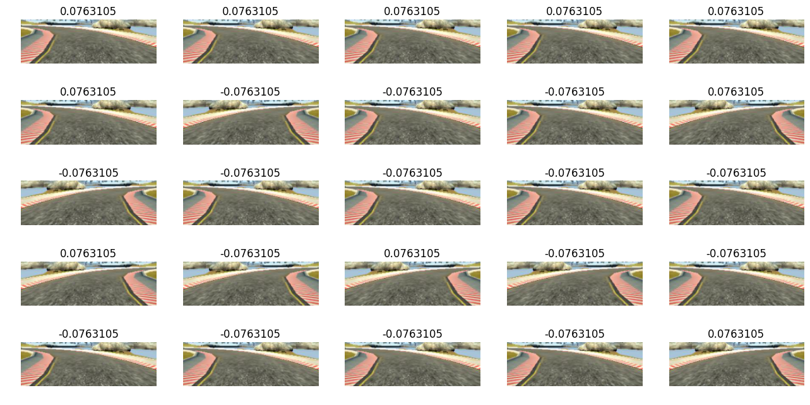
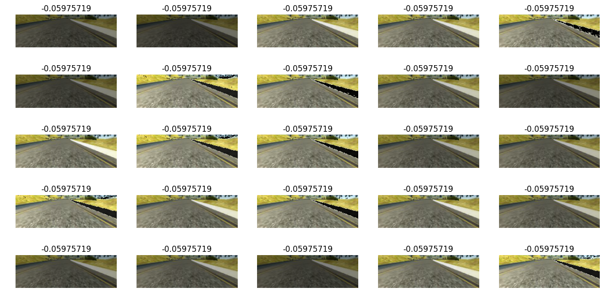
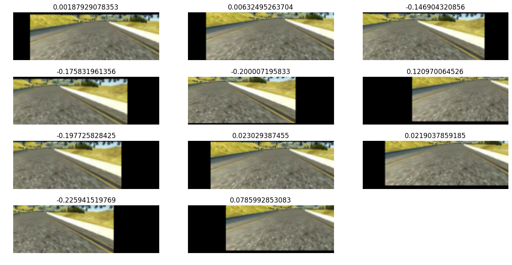

# Project 3: Behavioral Cloning

This is to document the submission of my behavioral cloning project from Udacity Nanodegree Program. The project was coded and debugged in MacBook Pro with 8 GB RAM. The model was trained in AWS gx2.2xlarge using udacity-carnd instance. Both Udacity data and my own collected data were tried and used. Both yields success on track 1. Only my own data yields success on track 2. Model architecture, training strategy and final performances were documented as below.


## 1. Model

I iterated through simple model with 2 ConvNets and 2 FC layers, comma.ai model and NVIDIA model and ended up with a modified NVIDIA model. Originally, none of them worked, so I started to turn into believing that it is not more about what model I chose, it is more about the data I fed into the model. After several iterations with the right data, I stayed with the following model.


|Layer (type)                   | Output Shape       |   Param #   |  Connected to                     
--------------------------------|--------------------|-------------|----------------------------------
lambda_1 (Lambda)               | (None, 66, 200, 3) |   0         |  lambda_input_1[0][0]             
convolution2d_1 (Convolution2D) | (None, 31, 98, 24) |   1824      |  lambda_1[0][0]                 
activation_1 (Activation)       | (None, 31, 98, 24) |   0         |  convolution2d_1[0][0]            
convolution2d_2 (Convolution2D) | (None, 14, 47, 36) |   21636     |  activation_1[0][0]               
activation_2 (Activation)       | (None, 14, 47, 36) |   0         |  convolution2d_2[0][0]            
convolution2d_3 (Convolution2D) | (None, 5, 22, 48)  |   43248     |  activation_2[0][0]               
activation_3 (Activation)       | (None, 5, 22, 48)  |   0         |  convolution2d_3[0][0]            
convolution2d_4 (Convolution2D) | (None, 3, 20, 64)  |   27712     |  activation_3[0][0]               
activation_4 (Activation)       | (None, 3, 20, 64)  |   0         |  convolution2d_4[0][0]            
convolution2d_5 (Convolution2D) | (None, 1, 18, 64)  |   36928     |  activation_4[0][0]               
activation_5 (Activation)       | (None, 1, 18, 64)  |   0         |  convolution2d_5[0][0]            
flatten_1 (Flatten)             | (None, 1152)       |   0         |  activation_5[0][0]               
dropout_1 (Dropout)             | (None, 1152)       |   0         |  flatten_1[0][0]                  
dense_1 (Dense)                 | (None, 100)        |   115300    |  dropout_1[0][0]                  
dropout_2 (Dropout)             | (None, 100)        |   0         |  dense_1[0][0]                    
activation_6 (Activation)       | (None, 100)        |   0         |  dropout_2[0][0]                  
dense_2 (Dense)                 | (None, 50)         |   5050      |  activation_6[0][0]               
activation_7 (Activation)       | (None, 50)         |   0         |  dense_2[0][0]                    
dense_3 (Dense)                 | (None, 10)         |   510       |  activation_7[0][0]               
activation_8 (Activation)       | (None, 10)         |   0         |  dense_3[0][0]                    
dense_4 (Dense)                 | (None, 1)          |   11        |  activation_8[0][0]               
**Total params:** 252219


* A Lambda layer was created to normalize the image as suggested by slack community and referenced from comma.ai model
* The model is fed with an RGB image with input size of (66, 200, 3) suggested by NVIDIA paper
* The first convolutional layer has 24 kernels with a size of 5x5 and strides of (2,2)
* The second convolutional layer has 36 kernels with a size of 5x5 and strides of (2,2)
* The third convolutional layer has 48 kernels with a size of 5x5 and strides of (2,2)
* The fourth convolutional layer has 64 kernels with a size of 3x3 and strides of (1,1)
* The fifth convolutional layer has 64 kernels with a size of 3x3 and strides of (1,1)
* Aboving layers are followed by 3 FC layers with 100, 50, 10 neurons and an output layer with 1 neuron is added to predict steering angle.
* Each model is followed by a RELU activation layer
* Dropout is added after the flatten and 1st FC layer to reduce overfit, various trials were performed and this combination performs the best
* Learning rate is set to 1e-3. The code could also read saved model and fine tune the model with new images, the learning rate was set to 1e-4 however it was not used for this training
* The model contains over 252k parameters, which is more than enough for this project


```python
if Path("model.json").is_file():
    with open("model.json", 'r') as jfile:
       model = model_from_json(json.load(jfile))
    adam = Adam(lr=0.00001, beta_1=0.9, beta_2=0.999, epsilon=1e-08, decay=0.01)
    model.compile(optimizer=adam, loss="mse")
    model.load_weights("model.h5")
    print("Loaded model from disk:")
    model.summary()            
 
else:
    model = Sequential()
    
    model.add(Lambda(lambda x: x/127.5 - 1., input_shape=input_shape))
    
    model.add(Convolution2D(24, 5, 5, subsample=(2,2), border_mode="valid"))
    model.add(Activation('relu'))

    model.add(Convolution2D(36, 5, 5, subsample=(2,2), border_mode="valid"))
    model.add(Activation('relu'))

    
    model.add(Convolution2D(48, 5, 5, subsample=(2,2), border_mode="valid"))
    model.add(Activation('relu'))
    

    model.add(Convolution2D(64, 3, 3, subsample=(1,1), border_mode="valid"))
    model.add(Activation('relu'))
    

    model.add(Convolution2D(64, 3, 3, subsample=(1,1), border_mode="valid"))
    model.add(Activation('relu'))
    
    
    model.add(Flatten())
    model.add(Dropout(dropout))

    model.add(Dense(100))
    model.add(Dropout(dropout))
    model.add(Activation('relu'))    

    model.add(Dense(50))
    model.add(Activation('relu'))
   
    model.add(Dense(10))
    model.add(Activation('relu'))
    
    # Output a single value as the predicted steering value
    model.add(Dense(1))
    
    adam = keras.optimizers.Adam(lr=0.0001, beta_1=0.9, beta_2=0.999, epsilon=1e-08, decay=0.0)
    model.compile(optimizer=adam, loss="mse")
    model.summary()
```


## 2. Collecting data

As suggested by Udacity, recovery images need to be collected to teach the model how to recovery from off-road conditions. I spent days of work collecting recovery images manually at both turns and straight roads but it didn't work very well. So I decided to go with data augmentation metnod mentioned from slack community and this great [post](https://chatbotslife.com/using-augmentation-to-mimic-human-driving-496b569760a9) from Vivek. Thanks Vivek for his great post!

I drove at track 1 for two laps and be in the center as much as I can to collect the training data. I don't need to collect recovery images as it will be done by following image augmentations.

* The driving.csv file was first turned into a dataframe. Left and right images steering angles were added an offset of 0.25 to compensate their off-the-center positions and they were then concatenated to the center dataframe. Scikit-learn train_test_split method was used to produce training and validation set in order to combat overfit.

	```python
	# Load .csv into dataframe with initial space removed and column names defined
	df = pd.read_csv("/home/carnd/P3/" + "driving_log.csv", header=None, skipinitialspace=True, names=["center", "left", "right",  "steering", "throttle", "brake", "speed"])

	df = df[df.throttle>0.1]
	df = df[df.speed!=0]
	df = df.reset_index(drop=True)


	# Center Data
	center = df[['center', 'steering']]
	center.columns = ['image', 'steering']

	# Left Data
	left = df[['left', 'steering']]
	left.columns = ['image', 'steering'] 
	left.loc[:, "steering"] = left.steering.apply(lambda x: x+0.25)

	# Right Data
	right = df[['right', 'steering']]
	right.columns = ['image', 'steering']
	right.loc[:, "steering"] = right.steering.apply(lambda x: x-0.25)


	frames = [left, center, right]
	# Combine data
	data = pd.concat(frames, axis = 0, ignore_index = True)

	X = data.image
	Y = data.steering
	Y = Y.astype(np.float32)

	# split the data into train and val
	X_train, X_val, Y_train, Y_val = train_test_split(X, Y, test_size=0.20, random_state=1)
	X_train = X_train.reset_index(drop=True)
	Y_train = Y_train.reset_index(drop=True)
	X_val = X_val.reset_index(drop=True)
	Y_val = Y_val.reset_index(drop=True)
	```

* After loading in the .csv file, the image was read in and was cropped to remove the top background and bottom car hood.
		```python
		def read_image(image_path, steering):
		    image = mpimg.imread("/home/carnd/P3/" + image_path)
		    # remove one-third from top and 25 pixels from bottom
		    shape = image.shape
		    image = image[int(shape[0]/3):int(shape[0]-25), 0:shape[1]]
		    image = cv2.resize(image, (img_cols, img_rows), interpolation=cv2.INTER_AREA)
		    return image, steering
		```
* The image was then:

	**randomly flipped:** to create data covering both left and right turns and recovery turns.
	```python
	def flip(image, steering):
	    if np.random.randint(2)==0:
	        image_flip = cv2.flip(image, 1)
	        steering *= (-1.)
	    else:
	        image_flip = image
	    return image_flip, steering
	```
	

	**randomly changed the V channel(brightness) value :** to create data under various lighting conditions
	```python
	def change_brightness(image, steering):
	    image = cv2.cvtColor(image, cv2.COLOR_RGB2HSV)
	    image[:,:,2] = image[:,:,2] * np.random.uniform(0.4, 1.2)
	    image = cv2.cvtColor(image, cv2.COLOR_HSV2RGB)
	    return image, steering
    ```
	


	**randomly shifted in both vertical and horizontal direction:** to create **recovery** images. This is crucial as I wasn't able to collect these images manually. Being able to shift images and compensate steering angles accordingly provides great accuracy compare to collecting them manually as the latter is very hard to control and it makes it more likely to feed bad data into the model.
    ```python
	def shift(image, steering):
	    trans_range = 180
	    tr_x = trans_range*np.random.uniform()-trans_range/2
	    steer_ang = steering + tr_x/trans_range*2*.2
	    tr_y = 10*np.random.uniform()-10/2
	    #tr_y = 0
	    Trans_M = np.float32([[1,0,tr_x],[0,1,tr_y]])
	    image_tr = cv2.warpAffine(image,Trans_M,(200,66))

	    return image_tr, steer_ang
	```
	

* A preprocess function was created to augment data before feed into data generator and the add-up effect looks like this
	```python
	def image_preprocess(img_path, steering):
    image, steering = read_image(img_path, steering)
    image, steering = flip(image, steering)
    image, steering = change_brightness(image, steering)
    image, steering = shift(image,steering)
   
    image = np.array(image).astype("float32")
    image = image.reshape((1, img_rows, img_cols, 3))
    return image, steering
```
	


## 3. Training

fit_generator() was used to feed images in batches constantly(in a infinite loop) to the model. In each epoch, before the generation, training data would be randomly selected(to reduce overfit). We don't want to create a bias for the model to think that we are always driving in small angles as there are significant amount of data with very small steering angle. so we chose to use them starting at a low probability and then graduately increase this probability to account for these imgaes.
	
```python
def batchgen_train(X, Y):
    
    start = 0
    features = np.ndarray(shape = (batch_size_train, img_rows, img_cols, 3))
    labels = np.ndarray(shape = (batch_size_train,))

    while 1:
        ind = np.random.choice(range(X.shape[0]), batch_size_train)
        X_batch = X[ind]
        Y_batch = Y[ind]
        

        for i in range(start, start+batch_size_train):

            keep_pr = 0 

            while keep_pr==0:
                image, label = image_preprocess(X_batch.iloc[i%batch_size_train], Y_batch.iloc[i%batch_size_train])
                # if small steering angle
                if abs(label)<0.15:
                	# pr_threshold changes from 1 to smaller than 1, so including small angle images with a probability from small to big
                    if pr_threshold<np.random.uniform():
                    	# include this image, otherwise exclude this image
                        keep_pr = 1

                # if large steering angle
                else:
                	# include this image
                    keep_pr = 1
            features[i%batch_size_train] = image
            label = np.array([[label]])
            labels[i%batch_size_train] = label
        start = start + batch_size_train
        yield (features, labels)
```

The training was repeated for 10 times and 10 different models were created. All worked and I've chosen the best one I think for performance verification.

```python
pr_threshold = 1
for i in range(10):

    history = model.fit_generator(batchgen_train(X_train, Y_train),
                    samples_per_epoch=samples_per_epoch, 
                    nb_epoch=nb_epoch,
                    validation_data=batchgen_val(X_val, Y_val),
                    nb_val_samples=nb_val_samples,          
                    verbose=1)

    fileModelJSON = 'model_' + str(i) + '.json'
    fileWeights = 'model_' + str(i) + '.h5'

    save_model(fileModelJSON,fileWeights)
    pr_threshold = 1/(i+1)
```

## 4. Performance

## 5. Reflections


## 8. Credits and References
* [Vivek's post about data augmentation](https://chatbotslife.com/using-augmentation-to-mimic-human-driving-496b569760a9)
* [Keras documentation](https://keras.io)
* [Comma.ai keras model](https://github.com/commaai/research/blob/master/train_steering_model.py)
* [Nvidia's End to End Learning for Self-Driving Cars](http://images.nvidia.com/content/tegra/automotive/images/2016/solutions/pdf/end-to-end-dl-using-px.pdf)  
* [Batch Normalization: Accelerating Deep Network Training by Reducing Internal Covariate Shift](https://arxiv.org/abs/1502.03167)  
* [How does the dropout method work in deep learning?](https://www.quora.com/How-does-the-dropout-method-work-in-deep-learning)  


