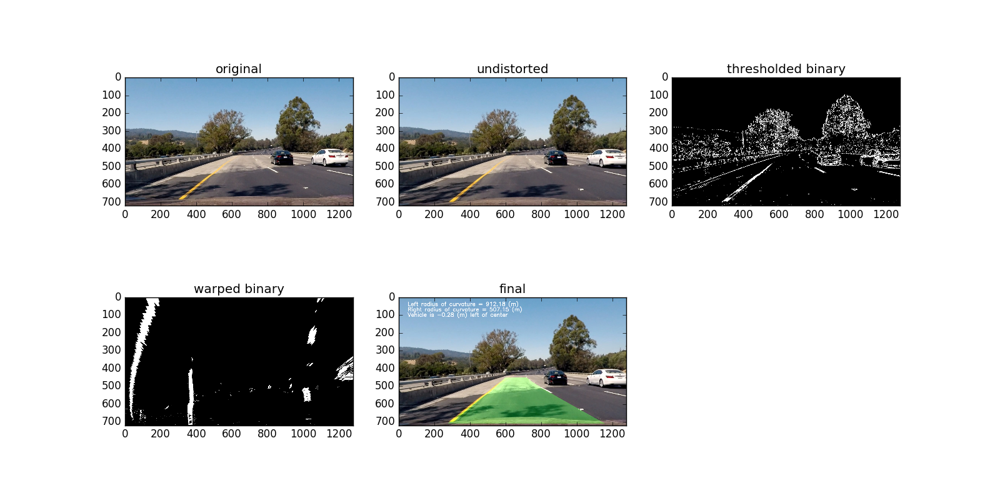

##Writeup 


---

**Advanced Lane Finding Project**

The goals / steps of this project are the following:

* Compute the camera calibration matrix and distortion coefficients given a set of chessboard images.
* Apply a distortion correction to raw images.
* Use color transforms, gradients, etc., to create a thresholded binary image.
* Apply a perspective transform to rectify binary image ("birds-eye view").
* Detect lane pixels and fit to find the lane boundary.
* Determine the curvature of the lane and vehicle position with respect to center.
* Warp the detected lane boundaries back onto the original image.
* Output visual display of the lane boundaries and numerical estimation of lane curvature and vehicle position.


[image2]: ./test_images/test1.jpg "Road Transformed"
[image3]: ./examples/binary_combo_example.jpg "Binary Example"
[image4]: ./examples/warped_straight_lines.jpg "Warp Example"
[image5]: ./examples/color_fit_lines.jpg "Fit Visual"
[image6]: ./examples/example_output.jpg "Output"
[video1]: ./project_video.mp4 "Video"

## [Rubric](https://review.udacity.com/#!/rubrics/571/view) Points
Here I will consider the rubric points individually and describe how I addressed each point in my implementation.  

---

###Camera Calibration and Undistort Image

The code for this step is contained in P4.py calibrate_camera() and undistort() method defined from line 14 to 52 and line 55 to 57 respectively.

It is recommended to use at least 20 images to get a good calibration, so a glob method was used to read in all calibration images one by one. objpoints is initialized as an empty list to store 3D points in real world space. imgpoints is initialized as an empty list to store 2D points in image plane. Each image's found corners by using opencv findChessboardCorners() method and pre-defined grid were appended to imgpoints and objpoints which were later used to calculate the camera and distrotion matrix by using opencv calibrateCamera() method.

Image undistrotion is applied by using opencv undistort() method with pre-calculated camera and distortion matrix above. Here is an image showing camera calibration and image undistortion.


###Pipeline (single images)

####1. Provide an example of a distortion-corrected image.
To demonstrate this step, I will describe how I apply the distortion correction to one of the test images like this one:

```python
# Undistort an image
def undistort(img, mtx=None, dist=None):
    img_undistort = cv2.undistort(img, mtx, dist, None, mtx)
    return img_undistort
```

####2. Describe how (and identify where in your code) you used color transforms, gradients or other methods to create a thresholded binary image.  Provide an example of a binary image result.
I used a combination of color and gradient thresholds to generate a binary image (thresholding steps at lines 94 through 211 in `P4.py`).  Here's an example of my output for this step. 


```python
def threshold(image):
   # Apply each of the thresholding functions
    gradx = abs_sobel_thresh(image, orient='x', sobel_kernel=3, thresh=(15, 100))
    # grady = abs_sobel_thresh(image, orient='y', sobel_kernel=3, thresh=(200, 255))
    mag_binary = mag_thresh(image, sobel_kernel=3, mag_thresh=(30, 100))
    dir_binary = dir_threshold(image, sobel_kernel=15, thresh=(0.7, 1,2))
    s_binary = color_threshold(image, channel='s')
    r_binary = color_threshold(image, channel='r')
    combined_binary = np.zeros_like(mag_binary)
    combined_binary[(gradx == 1) | ((s_binary==1) | (r_binary==1)) | ((mag_binary==1)&(dir_binary==1))] = 1
    


    return combined_binary
```

* gradx is obtained by applying sobel on x direction as we want to extract vertical lane lines as much as possible
* mag_binary is obtained by applying a square root of the sum of the sobel x and sobel y square
* dir_binary is obtained by applying a direction gradient simply calculated as the arctangent of y-gradient divided by x-gradient
* S channel was extracted as it is very good at identifying white lines 
* R channel was extracted as it is very good at identifying yellow lines
* these binary channels were combined with experimented threshold and that's how i got the final threshoded binary image


####3. Describe how (and identify where in your code) you performed a perspective transform and provide an example of a transformed image.

The code for my perspective transform includes a function called `perspective_transform()`, which appears in lines 59 through 92 in the file `P4.py`. The `perspecctive_transform()` function takes as inputs an image as well as source (`src`) and destination (`dst`) points.  I chose the hardcode the source and destination points in the following manner:

```
src = np.array([[585., 455.],
                [710., 455.],
                [1130., 710.],
                 [190., 710.]], np.float32)

dst = np.array([[300., 100.],
                [1000., 100.],
                [1000., 720.],
                [300., 720.]], np.float32)

```
This resulted in the following source and destination points:

| Source        | Destination   | 
|:-------------:|:-------------:| 
| 585, 455      | 300, 100        | 
| 710, 455      | 1000, 100      |
| 1130, 710     | 1000, 720      |
| 190, 710      | 300, 720        |

I verified that my perspective transform was working as expected by drawing the `src` and `dst` points onto a test image and its warped counterpart to verify that the lines appear parallel in the warped image.


####4. Describe how (and identify where in your code) you identified lane-line pixels and fit their positions with a polynomial?

I used the sample code in the classroom to extract lane lines pixels and polynomial coefficients. The code is defined in sliding_window() method in 'P4.py'. Here is an example using above images.


####5. Describe how (and identify where in your code) you calculated the radius of curvature of the lane and the position of the vehicle with respect to center.

I did this in lines 378 through 403 in my code in `P4.py` in calculate_radius_of_curvature() as a classmethod
Pixels distance is converted to Meters using the pixels per meter value provided in the classroom.
Vehicle distance compared to center of road is calculated and drawn onto each frame. vehicle ideal position is the center of image, vehicle true position is the midpoint of the two bottom points calculated by fitting image.shape[0] into left and right polynomial coefficients. Then I just get the difference and multiplies by the pixel per meter to get the value in meters.


####6. Provide an example image of your result plotted back down onto the road such that the lane area is identified clearly.

I implemented this step in lines 314 through 339 in my code in `P4.py` in the function `draw_lane()`.  Here is an example of my result on a test image:



---

###Pipeline (video)

output video is inside the repository 

---

###Discussion

####1. Briefly discuss any problems / issues you faced in your implementation of this project.  Where will your pipeline likely fail?  What could you do to make it more robust?

* image thresholding isn't robust as seen from the video. more work needs to be done to identify a better thresholding method
* More work needs to be done to auto detect if lane lines are real, current auto-detection doesn't seem to work very well. Need to figure out how to detect the parallelness, lane distances and correct from false lanes.

