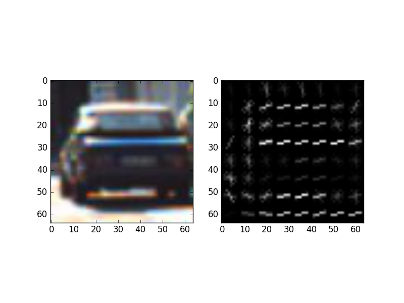
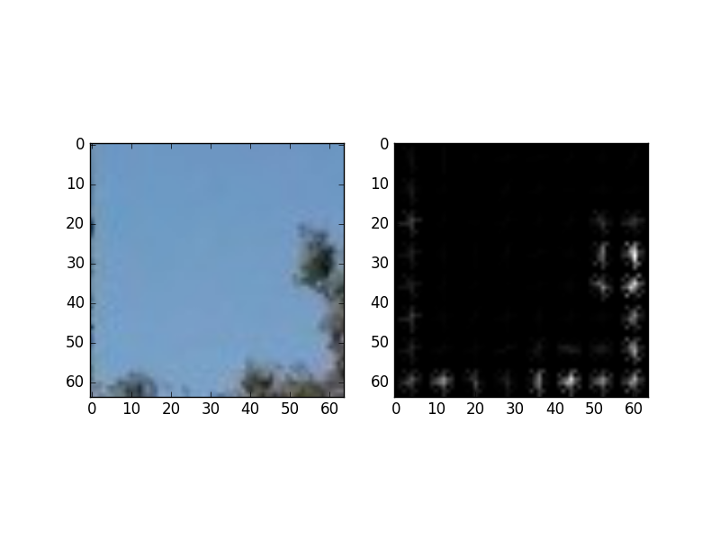
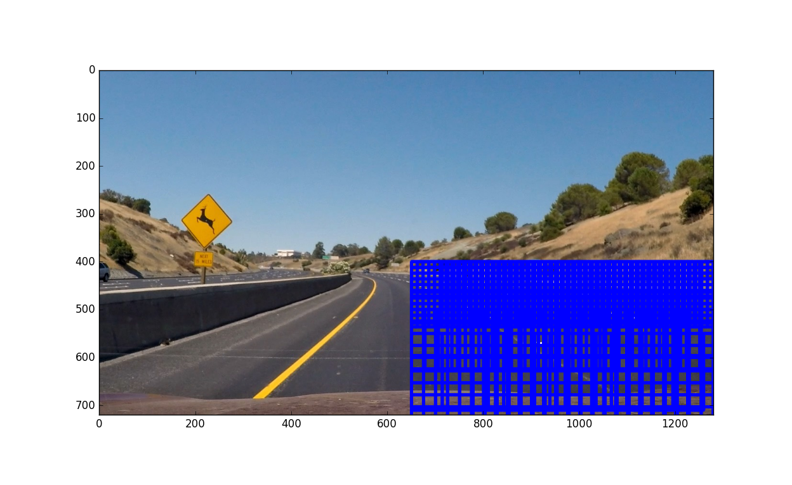
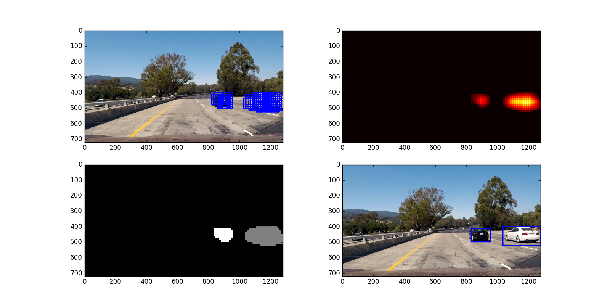
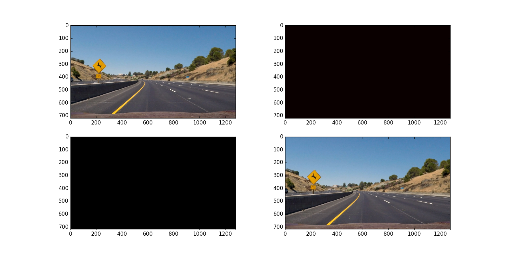
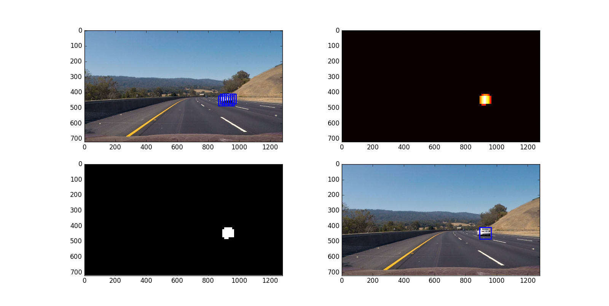
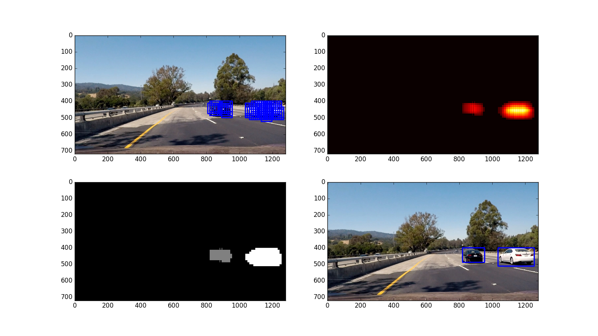
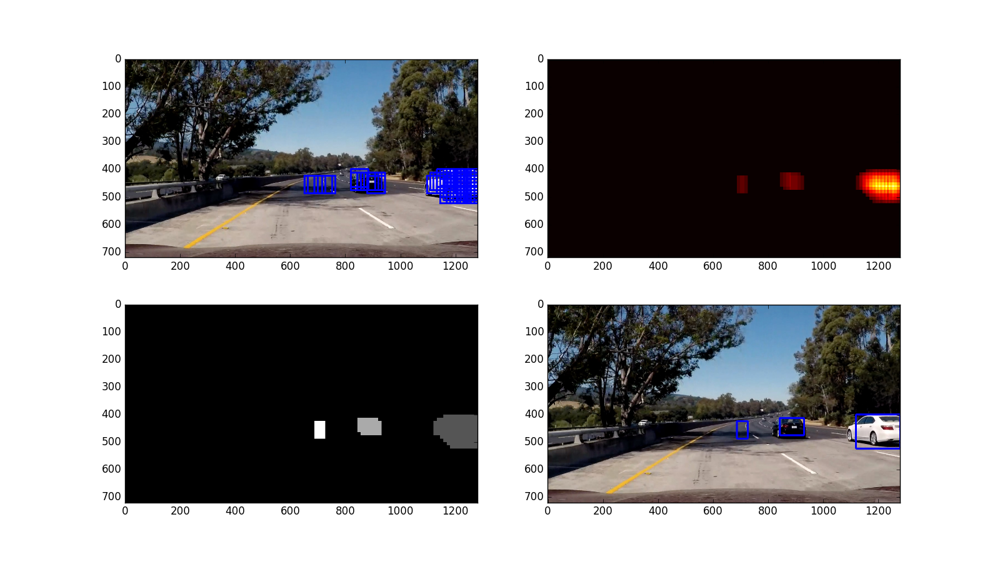
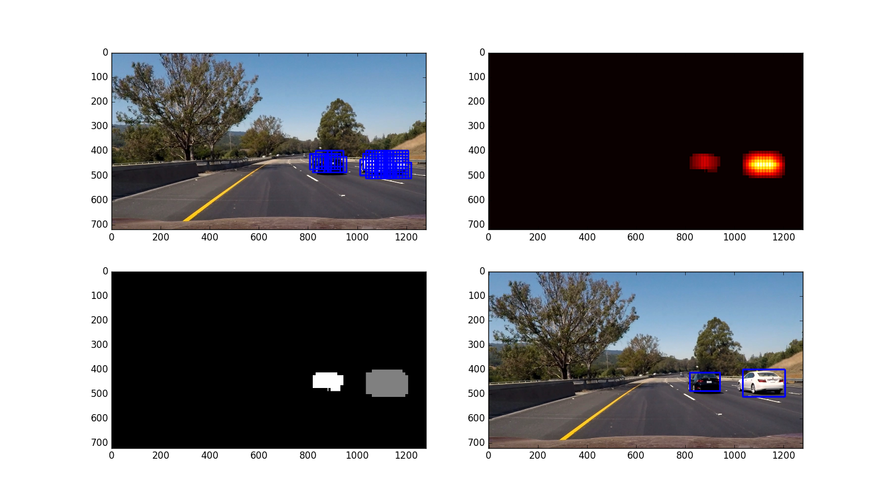
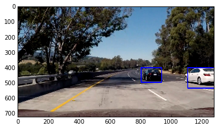

**Vehicle Detection Project**

The goals / steps of this project are the following:

* Perform a Histogram of Oriented Gradients (HOG) feature extraction on a labeled training set of images and train a classifier Linear SVM classifier
* Optionally, you can also apply a color transform and append binned color features, as well as histograms of color, to your HOG feature vector. 
* Note: for those first two steps don't forget to normalize your features and randomize a selection for training and testing.
* Implement a sliding-window technique and use your trained classifier to search for vehicles in images.
* Run your pipeline on a video stream (start with the test_video.mp4 and later implement on full project_video.mp4) and create a heat map of recurring detections frame by frame to reject outliers and follow detected vehicles.
* Estimate a bounding box for vehicles detected.

---
###Step 1: Train a Classifier

The first step is to train a classifier that can identify **car** and **not car** pictures. [GTI vehicle image database](http://www.gti.ssr.upm.es/data/Vehicle_database.html) and [KITTI vision bench mark suite](http://www.cvlibs.net/datasets/kitti/) provide 8000+ .png cars and not-cars images each, I used all of them and trained a Linear SVM classifier.

I used HOG, Color Histogram and Binned Spatial to extract car/not-car features from each image and assigned a corresponding car/not-car label. This is done for all training images.

In `lesson_functions.py`:
* `get_hog_features()` returns the extracted HOG features
* `bin_spatial()` returns the extracted binned spatial features
* `color_hist()` returns the extracted color histogram features
* `extract_features()` returns the concatenated features of all 3 combined

I explored different color spaces and different `skimage.hog()` parameters (`orientations`, `pixels_per_cell`, and `cells_per_block`). Here is an example of extracted HOG features from a car and not-car images with HOG parameters of `orientations=9`, `pixels_per_cell=(8, 8)` and `cells_per_block=(2, 2)`:




In `train.py`:
* training data is normalized (scaled to zero mean and unit variance) using sklearn `StandardScaler` package before training the classifier, it is achieved in lines 61 to lines 63.
* the resulting model was saved in a .pkl file and was later used by our pipeline, this is achieved using sklearn `joblib` packages defined in lines 94 to 95.
* I tried various settings and found out with `loss='hinge'`, it results in best training and test accuracy.
* Past model is stored in models folder, the final model used is `model_yuv_982all.pkl`

The resulting training and test accuracy of SVC is:
```
model_yuv_982all.pkl"
244.6871 seconds to extract training features
8.3024 seconds to normalize training features
Feature vector length: 6108
122.5 Seconds to train SVC...
Training Accuracy of SVC =  0.9212
Test Accuracy of SVC =  0.9079
```

---
###Step 2: Create an image Pipeline

A sliding window technique was used to scan through each image. I cropped out the sky and left half of the image and used 4 different sizes of window with different overlappping and start-end positions.
* `pyramid`, a global list defines sizes, start-end position of x and y directions and overlappings.
* `slide_window()` defined in `lesson_functions.py` returns a list of all scanning windows
* `search_windows()` defined in `
P5.py` returnss a list of windows that has identifed car predicted by the pre-trained classifier.

Then heatmap thresholding technique was used to select the bounding boxes of each identifed car in and this also removes false positives. 
* `add_heat()` defined in `P5.py` returns a heatmap
* `apply_threshold()` defined in `P5.py` returns a thresholded heatmap with false positives less than the threshold removed

The identified bounding boxes was redrawn back on to the origin image.
* `draw_labeled_bboxes()` returns an new image with bounding boxes drawn.

In order to achieve best result:

* The clasisifer first needs achieve high accuracy. I settled down on the following parameters as it yields best classification result in combination of sliding windows parameters.
```python
color_space = 'YUV' # Can be RGB, HSV, LUV, HLS, YUV, YCrCb
orient = 9  # HOG orientations
pix_per_cell = 8 # HOG pixels per cell
cell_per_block = 2 # HOG cells per block
hog_channel = 'ALL' # Can be 0, 1, 2, or "ALL"
spatial_size = (16, 16) # Spatial binning dimensions
hist_bins = 16    # Number of histogram bins
spatial_feat = True # Spatial features on or off
hist_feat = True # Histogram features on or off
hog_feat = True # HOG features on or off
```
* Here are all slinding windows I used, more overlapping windows resuts in better results however it increases processing time. My strategy is to put smaller windows with great quantities in upper section and gradually incease the size and decrease quantities moving down. I played around with all parameters and determines below achieve best result. 
 

* Here are results on test images:







* Noticed the fifth image has a false positive detected, I removed this by calculating the area of each bounding boxes and removes any with area<4000 and area>40000 as a car's size cannot be smaller or greater than that in a driver's view. Here is result with false positive removed. The code is defined in `remove_false_positives()` in P5.py.



---
###Step 3: Creat a video Pipeline
Same image pipeline is used with additional tracking techniques. A `Vehicle()` class was defined to track vehicle position in each frame. I originally averaged the bounding boxes of last 5 frames, but problems came when a second car came into the view and it's kind of tricky to calculate the average for each and keeps track of them, also this will not reject false positives. So I used heatmap thresholding again. The classmethod `best()` in `P5.py` returns the best position of all cars in each frame calculated by averaging last 5 frames' best position if detected. 

[Here](https://youtu.be/IdfRqx4WMvA) is the link to the output video.


---

###Discussion
1. It takes 3-4 seconds to process each frame and more than an hour to process a 50s video. Better techniques need to be applied to reduce the processing time while maintaining the quality of the detection.
2. Better techniques like deep learning should be more capable to achieve a better result and speed.


